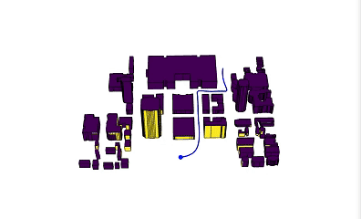
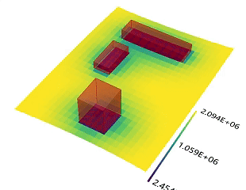
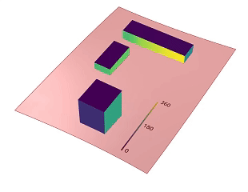
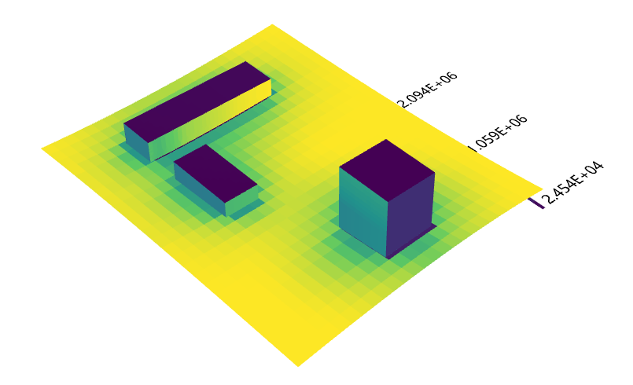
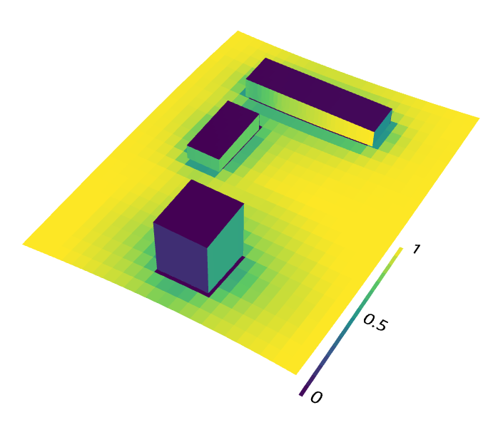
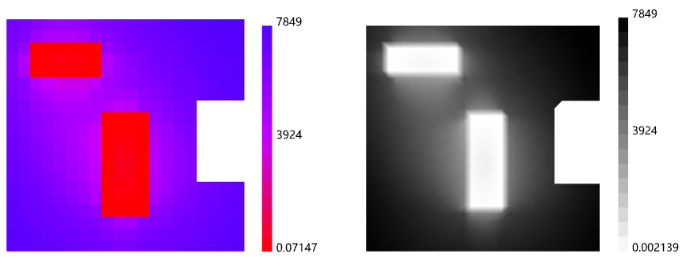

# Space Visual · 视线分析工具集

**为 Rhino + Grasshopper 提供从分析网格、视线计算到热力图展示的一套工作流。**

从这里能看见什么？哪些位置更开敞？建筑的哪些表面更容易被看见？Space Visual 将这些问题整合进 **11 个组件、4 个功能分组**，用于建筑、场地与城市空间的视线研究。

[English](README.md) · **简体中文**

[下载与安装](#下载与安装) · [快速开始](#快速开始) · [组件一览](#组件一览) · [源码构建](README.md#building-from-source)

  

*城市视线研究示例：沿路径移动的观察点与周边建筑表面。*

## 分析效果

### 从场地到建筑表面

**Isovist 3D** 从观察点出发研究可见空间；**Received Visibility 3D** 则统计一组观察点对各个网格面的可见情况。分析结果接入 **Colorize**，即可在 Rhino 视口中查看空间分布。

| 场地分析 | 建筑表面分析 |
| --- | --- |
|  |  |
| 查看遮挡物周围地面上的数值分布。 | 查看不同建筑表面上的数值分布。 |

### 用热力图阅读空间差异

| 三维分析热力图 | 归一化显示 |
| --- | --- |
|  |  |

*以上为项目提供的效果素材。解读时请结合所选指标和图例；仅凭 0–1 色标不能判断具体指标。*

### 分析与表达放在同一个工作流

通过 **Parameter** 设置配色、数值范围、图例位置与文字大小，再由 **Colorize** 直接在视口绘制网格、图例和标签。需要将结果保存在 Rhino 文档中时，可使用 Bake。

## 下载与安装

| 平台 | 下载 | 兼容说明 |
| --- | --- | --- |
| Windows | [SpaceVisual.gha](bin/Debug/SpaceVisual.gha) | 原 Windows Debug 构建，目标支持 Rhino 7（SR0+）与 Rhino 8 |
| Mac | [SpaceVisual.gha](bin/Mac/Release/SpaceVisual.gha) | 独立的 Rhino 7 构建，作者已确认 Intel Mac / Rhino 7.8 本地可用 |

Mac 的 Rhino 8、Apple Silicon 与 Rhino 7.0–7.7 尚未验证。两个下载文件名称相同，请按平台选择；只需下载 `.gha`。

1. 点击对应平台的文件链接，再点击 GitHub 的 **Download raw file**。
2. Windows 用户右键文件 → **属性 → 解除锁定**（若显示此选项）。
3. 在 Grasshopper 中打开 **File → Special Folders → Components Folder**。
4. 退出 Rhino，把 `SpaceVisual.gha` 复制到该文件夹。
5. 重启 Rhino 与 Grasshopper，找到 **Space Visual** 标签页。

Windows 常用目录为 `%APPDATA%\Grasshopper\Libraries\`。Mac 请以 Grasshopper 打开的目录为准，详细路径与验证清单见 [Mac 安装说明](MAC-TESTING.md)。

Libraries 中只保留一份 Space Visual；旧版请移到目录外备份。Windows 与 Mac 版本共用组件 GUID，同时安装会产生重复组件。

## 快速开始

### 做一张二维可视性热力图

1. 准备闭合的平面边界曲线，以及同平面内的遮挡曲线。
2. 将边界接入 **View Grid**，获得分析网格 `M` 和每个网格面的中心点 `P`。
3. 将 `P` 接到 **Build Graph 2D → Points**，遮挡曲线接到 `_Obstacles`。
4. 将输出的 `Graph` 接入 **VGA Metrics 2D**。可以先看 `Connectivity`，即直接可见的相邻节点数量。
5. 将原分析网格接到 **Colorize → Mesh**，指标接到 `Values 0`。可选接入 **Parameter** 调整颜色与图例。

保持点与结果的顺序一致，使每个数值对应正确的网格面。如果场地包含实体障碍物，应在建图前排除障碍内部的采样点，并同步处理用于着色的网格。

### 换一个分析问题

| 想回答的问题 | 接线方向 |
| --- | --- |
| 在平面中，从这里能看见什么？ | 观察点 + 遮挡曲线 → **Isovist 2D** |
| 每个位置的天空有多开敞？ | 观察点 + 遮挡网格 → **Isovist 3D** → `SVF` → **Colorize** |
| 哪些表面能被更多观察点看见？ | 观察点 + 目标/遮挡网格 → **Received Visibility 3D** → `Hit Count` → **Colorize** |
| 可视图上的最短路径是什么？ | **Build Graph 2D** → **Visual Path 2D**，另接起终点 |
| 到目标位置需要几次视线转换？ | **Build Graph 2D** → **From Viewpoint 2D** |

### 数据与参数

- 三维分析优先使用 Mesh；组件支持的 Brep/Surface 输入会在内部转换为网格。视距与网格密度应结合模型单位设置。
- Isovist 3D 默认采样上半球。SVF 是**给定视距内**未受遮挡天空的余弦加权估计，受采样数与最低仰角影响。
- Received Visibility 的结果按输入障碍网格的面顺序依次排列；着色时应使用相同顺序的网格面。
- Colorize 的数值数量必须对应网格面数或顶点数。多个 Values 输入按相同索引等权平均，混合不同量纲指标前应先归一化。该组件直接预览、不输出数据，可通过 Bake 固化结果。
- 建议先用粗网格检查接线与几何。可视图构建需要成对检查观察点，点数增加会明显增加计算量。

## 组件一览

| 分组 | 组件 | 作用 |
| --- | --- | --- |
| Build | **View Grid Triangle** | Curve / Surface / Brep / Mesh 转三角分析网格与面中心点；通过间距控制密度 |
| Build | **View Grid** | 闭合平面 Curve、Surface 或单面 Brep 转四边分析网格与面中心点 |
| Analyze 2D | **Build Graph 2D** | 根据观察点与遮挡曲线构建可视图，输出可见连线 |
| Analyze 2D | **Isovist 2D** | 输出可视多边形、面积、周长、紧凑度、最大半径与重心偏移 |
| Analyze 2D | **VGA Metrics 2D** | 整合度（平均深度的倒数）、熵、控制度、聚类系数与连通度 |
| Analyze 2D | **From Viewpoint 2D** | 输出可视图步数、直线距离与方位角；不可达节点返回 NaN |
| Analyze 3D | **Isovist 3D** | 采样视线、估计体积/表面积、最大/平均半径、重心偏移与 SVF |
| Analyze 3D | **Received Visibility 3D** | 每个面的可见观察点数量、平均/最小距离、法线对齐程度与面中心 |
| Visualize | **Visual Path 2D** | 可视图上的 A* 最短路径；起终点吸附到最近的图节点 |
| Visualize | **Parameter** | 设置配色、数值范围、图例位置与图例/文字缩放 |
| Visualize | **Colorize** | 视口热力图、图例和标签，支持 Bake 与多组数值等权混合 |

## 源码与参与

Windows 与 Mac 的构建命令见 [英文 README 的源码构建说明](README.md#building-from-source)。Mac 的功能检查见 [MAC-TESTING.md](MAC-TESTING.md)。

欢迎通过 [Issues](https://github.com/YantingShen-dev/SpaceVisual_grasshopper/issues) 提交问题与使用反馈；请附上平台、Rhino 版本、复现步骤，以及可分享的最小示例。

[MIT](LICENSE) © 2026 POLY LAB · [Yanting Shen](https://github.com/YantingShen-dev)
